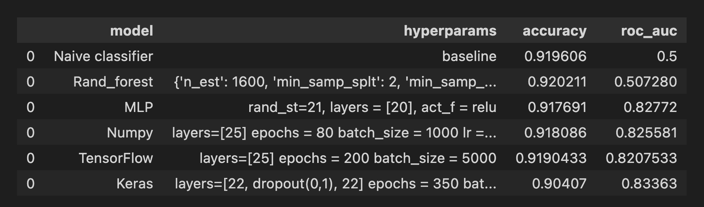

# ML-churn 
Churn prediction: I predict which customers are likely to stop being customers of the bank using different kinds of implementations of a multilayer perceptron.

 ## Using models:

* Baseline. Naive classifier - the most popular class for predictions.
* Random forest
* Scikit-learn with MLPClassifier
* Multilayer perceptron from Keras. 
* Multilayer perceptron from TensorFlow. 
* NumPy: Implements the best architecture that was achieved earlier but with NumPy using matrix calculations

## Dataset

The dataset contains bank information with an unbalanced target. It includes various data about their customers: financial information, age, services that they used, and the target – whether they left the bank in the next three months. 
There are two files: bank_data_test.csv and bank_data_train.csv and result prediction test_predictions.csv. See [data.zip](https://github.com/borolya/churn/blob/main/data.zip 'link to data')

## Validtion and Results

Due to unbalanced classes the validation metrics is ROC_AUC.

  

